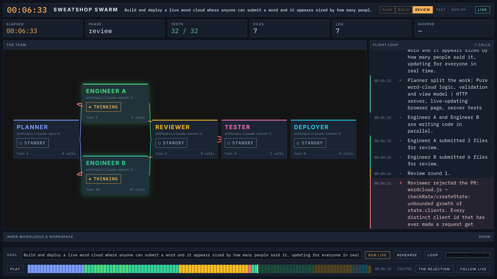
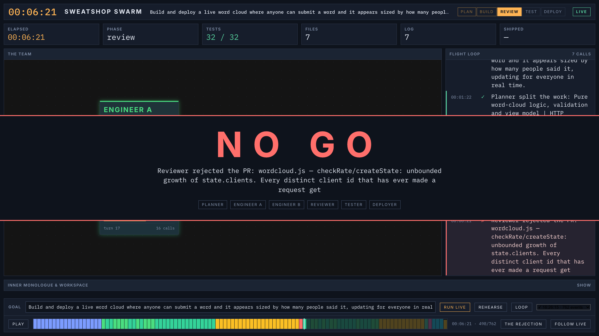

# Sweatshop Swarm

**Watch a software team ship a feature live.**

Give it a goal — *"build and deploy a live word cloud where anyone can submit a
word and it appears sized by how many people said it"* — and six agents go to
work in front of you. A Planner decomposes it, two Engineers write code in
parallel, a Reviewer sends it back, the Engineers fix it, a Tester runs the
suite, a Deployer ships it.

At the end there's a URL and a QR code. The room scans it, types a word, and
watches the cloud reshape itself.

The graph isn't decoration — it's the product. This is agentic AI made legible.



---

## It actually does this

One real live run, on the goal above:

| Duration | Outcome | Tests | Cost |
|---|---|---|---|
| 9.5 min | rejected on round 1, fixed, approved on round 2 | 37 passing | $1.35, 83% of input from cache |

`sample-live-run` and `sample-failed-run` ship in `runs/`, so a fresh clone can
replay a real run and a real failure without an API key.

## The rejection is real

The Reviewer holds a strict rubric — validation, unhandled failure paths,
unbounded growth, XSS, failure-case coverage. **The Engineers are never shown
it.** First drafts genuinely miss things and the Reviewer genuinely finds them.

Nothing forces a rejection. If an Engineer nails it first time, it's approved
and the demo is shorter.

Its unprompted finding on that run: `checkRate` kept a record of every client id
that had ever made a request — so the rate limiter protecting the app was itself
an unbounded memory leak.



## How it's built

- **Orchestration** — hand-rolled, no LangGraph or CrewAI. ~1,300 lines.
- **Agents** — a role, a system prompt, a tool whitelist, and a loop.
- **Models** — Claude Opus 5 plans, Claude Sonnet 5 works.
- **Providers** — Anthropic or OpenRouter; a base-URL swap, not a second code path.
- **Tools** — `write_file`, `read_file`, `list_files`, `run_command`, `run_tests`,
  `deploy`, `http_check`, all sandboxed.
- **Transport** — every agent action is an event on a WebSocket. The schema is
  the contract.
- **UI** — React + React Flow, driven entirely by that event stream.

All view state is a pure function of the event log, so replaying a recorded run
re-runs the same reducer over the same array. There's no "replay mode" branch in
the frontend — which is why the scrubber is honest to put on a projector.

---

## Running it

```bash
npm install
cp .env.example .env
```

Put **one** key in `.env` — `OPENROUTER_API_KEY` or `ANTHROPIC_API_KEY`. Then
check what your provider actually accepts (costs a fraction of a cent, and
prints the `.env` lines to paste):

```bash
npm run probe
```

Two processes:

```bash
npm run server
```

```bash
npm --workspace @swarm/web run dev
```

Open <http://localhost:5250>, type a goal, press **Run live**.

### Commands

| Command | What it does |
|---|---|
| `npm run server` | The orchestrator and the WebSocket feed. |
| `npm run probe` | Ask your provider which features it really supports. |
| `npm run rehearse` | Full pipeline, scripted dialogue, no API calls. |
| `npm run swarm` | One live run, headless. `-- --goal "..."` to set the goal. |
| `npm test` | Unit tests. |
| `npm run typecheck` | Type-checks both packages. |

Every run prints its own cost in the flight loop, failed runs included.

### Without an API key

**Rehearsal mode** scripts the agents' dialogue and leaves everything else real —
real files, `node --test` really runs, the server really starts, the URL really
serves:

```bash
npm run rehearse
```

Runs are badged `REHEARSAL` from the event stream itself, not a UI toggle, so a
rehearsal can't be passed off as a live run by accident.

---

## Layout

```
packages/shared/        event schema, roster, wire protocol — the contract
packages/orchestrator/  agent loop, tools, pipeline, WebSocket server
packages/web/           React Flow mission control
runs/                   recorded runs, replayable through the scrubber
sandbox/                where the agents actually work (gitignored)
```

- [Architecture](docs/architecture.md) — the event schema, the loop, why it's shaped this way
- [Booth runbook](docs/runbook.md) — what to say, and what to do when it breaks

## Why hand-rolled orchestration

Because the orchestration *is* the project. The model writes code; everything
that makes six models into a team — routing, review gates, conflict resolution,
the observability layer — is the thing being built here. A framework would have
hidden exactly the part worth showing.
